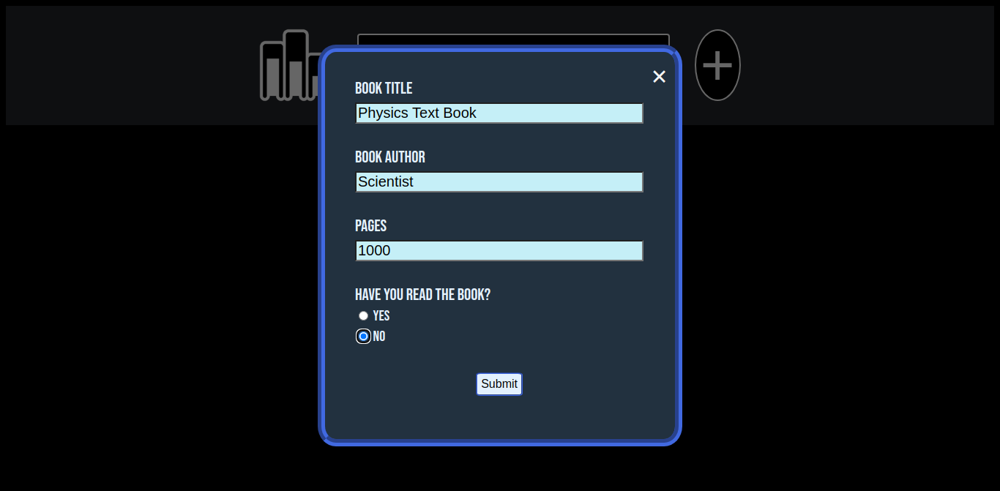
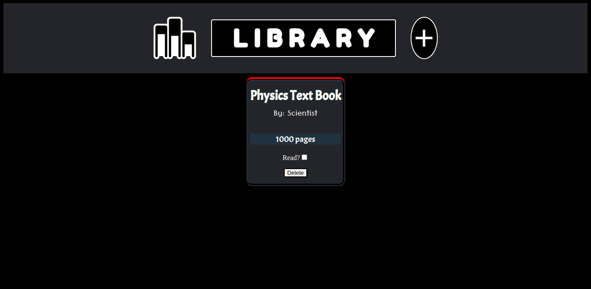

# Library

An online library that can store books and their information.
Created using HTML/CSS/javascript.

Features:
    1. Can store book title, author(s) and number of pages.
    2. Can store read status of each book which can be toggled.
    3. Book(s) can be deleted from the library.
    4. Library can be stored locally using localStorage. [Firebase](https://github.com/xari4808/library/tree/firebase) implementation in progress

